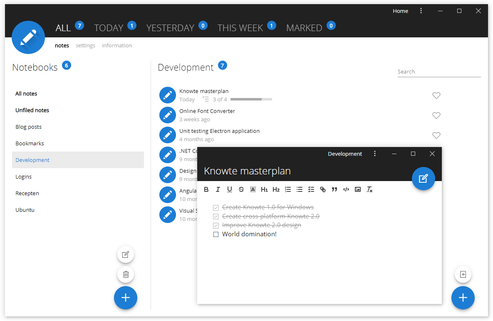

# Knowte

Knowte is a note taking application that allows you to quickly and easily organize and find your notes. This version is written using Electron, Angular and Typescript. The original Knowte (for Windows), which is written in WPF and C#, remains available <a href="https://github.com/digimezzo/knowte-windows">here</a>.

[](https://github.com/digimezzo/knowte/releases/latest)
[](https://github.com/digimezzo/knowte/issues)
[](https://www.paypal.com/cgi-bin/webscr?cmd=_s-xclick&hosted_button_id=MQALEWTEZ7HX8)

<a href='https://ko-fi.com/S6S11K63U' target='_blank'></a>

## Screenshot



## Build instructions

```bash
$ git clone https://github.com/digimezzo/knowte.git
$ cd knowte
$ npm install            # Download dependencies
$ npm start              # Start Knowte
$ npm run electron:windows   # Build for Windows
$ npm run electron:linux     # Build for Linux
$ npm run electron:mac       # Build for Mac
```
